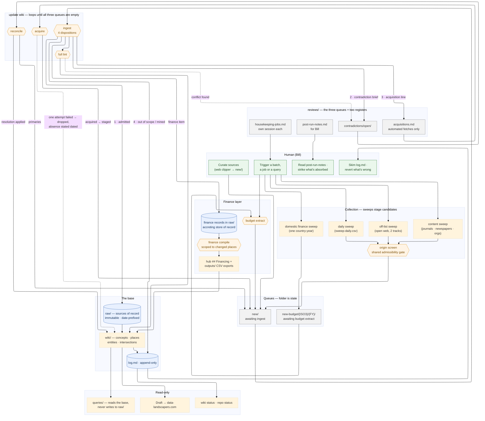

# Data Landscapers wiki — whole-project workflow

How material moves through the system. **`wiki/index.md` → *Processes* is the
authoritative directory** of every runnable process and its trigger phrase; this file
is the picture of how they fit together, and defers to it wherever they disagree.

**Rewritten 2026-07-29 (housekeeping job 13).** The previous version drew the
architecture as it stood on 2026-07-16 and had become actively misleading: it showed a
`reviews/gaps.md` register and a `contradictions/research/` quarantine (both withdrawn),
no sweeps, no acquisitions pass, no finance or budget layer, no housekeeping register,
and a `CLAUDE.md` ratification gate that no longer works that way. A fresh session
reading it would have rebuilt retired structures. The rendered `wiki-workflow.html` and
`wiki-workflow.svg` alongside it were exports of that same dead diagram and were deleted
rather than regenerated — the mermaid block below renders natively in Obsidian, so the
source is the artefact and there is nothing to keep in sync.

> **Colour key.** Blue = store of record · green = human touchpoint · amber = a pass ·
> grey = a queue or register.

## Reading it

- **`new/` is the only door.** Clips, sweep candidates, extracted budget records,
  primaries surfaced by reconcile, documents fetched by acquire — everything enters
  through the same queue and the same ingest screen. Nothing is admitted any other way.
- **Folder is state.** An item's folder *is* its processing status, and moving it out of
  `new/` is the last step of processing it — so an interrupted run resumes cleanly rather
  than half-committing.
- **Ingest has four dispositions and no parking limbo**: admitted to `raw/`; turned into
  a contradiction brief; turned into an acquisition line; or deleted. An item that is not
  admitted still leaves the queue.
- **The three queues each have exactly one draining pass** — contradictions/reconcile,
  acquisitions/acquire, `new/`/ingest — and `update wiki` loops all three because each
  refills the others. Housekeeping is the fourth register and is deliberately *not* in
  that loop: it gets its own session.
- **Finance records are the one exception to `raw/` immutability.** They accrete — later
  reporting is folded into the existing record as a dated line rather than spawning a new
  page — and they carry no per-deal hub bullet, because their hub presence is compiled in
  aggregate by finance compile.
- **`queries/` reads and never writes back.** Results are derived snapshots; research
  output from reconcile earns its place only by being ingested as a primary.
- **Oversight is git-backed.** CC acts and logs rather than asking; `log.md` records what
  changed and what to revert, and `post-run-notes.md` carries the few things that need
  Bill rather than a pass.

*(Not drawn, to keep the map legible: git underpins every store; `CLAUDE.md` governs the
whole pipeline; `wiki/reference.md` holds the schemas and thresholds every pass applies;
and a piece published on data-landscapers.com can re-enter through `new/` as admissible
third-party analysis.)*
